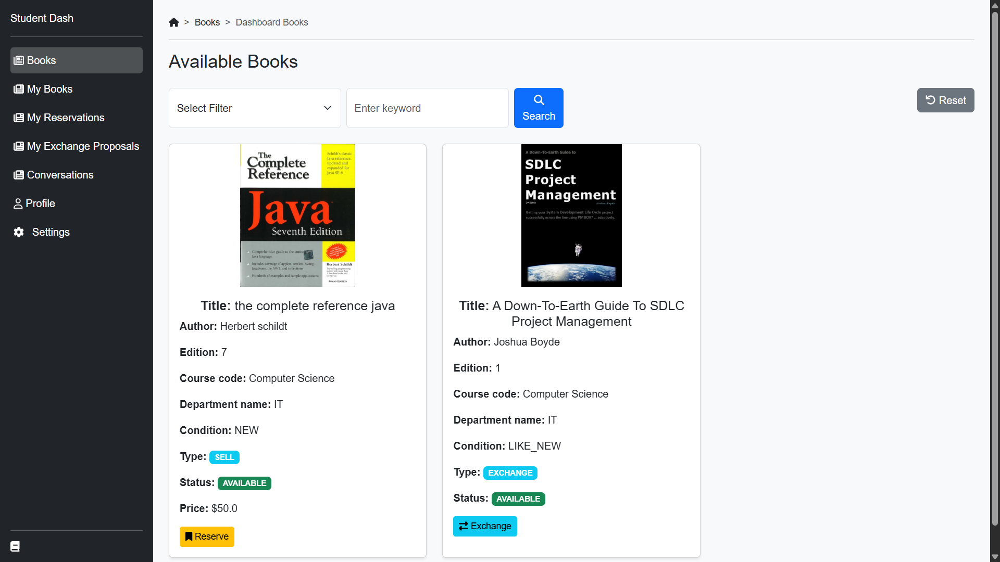
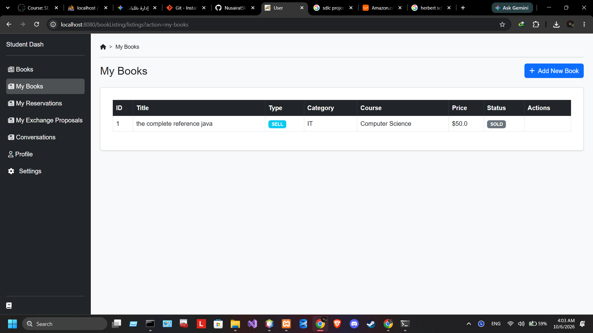
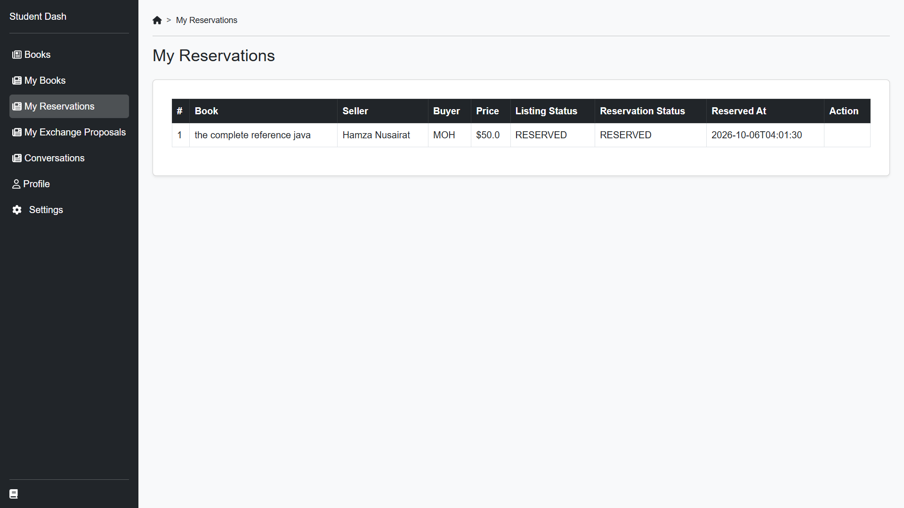
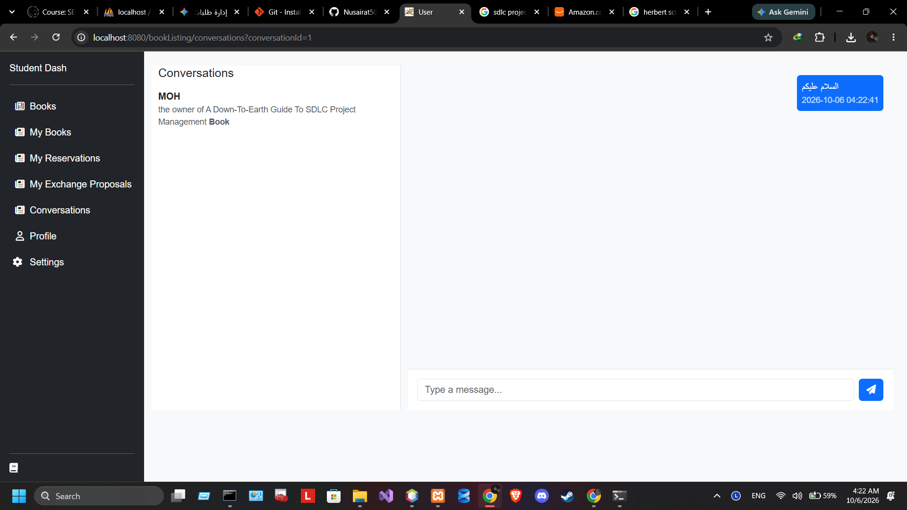
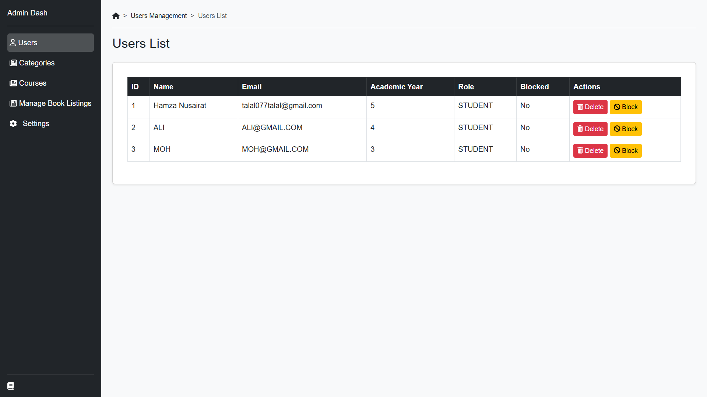
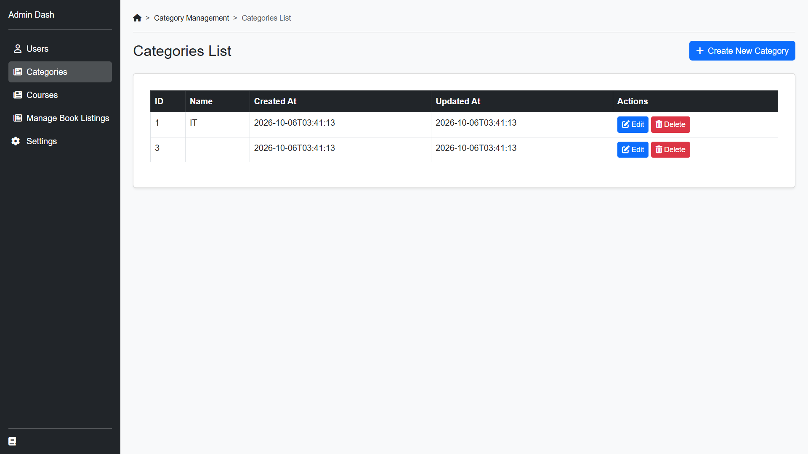

# 📚 Book Trading & Exchange Platform

An academic full-stack Web Application developed as a course project for **Software Engineering** at university. The platform was built to allow students to buy, sell, reserve, and exchange academic textbooks and general books easly.

🚀 Features:

👤 Student Features:

**Book Listings: Browse, search, and filter books by Title, department, course code, condition, and pricing/exchange options.

**Exchange Proposals: Submit and manage direct book exchange offers with other students.

**Reservation System: Reserve desired textbooks for direct purchase or trade.

**In-App Messaging: Coordinate trade details directly with buyers or sellers.

**User Profile: Track active listings, trade history, and account settings.

🛡️ Admin Dashboard

**Content & System Management: Full control to manage users, book listings, categories, academic departments, and courses.

**Platform Oversight: Monitor trading activity and ensure data consistency across the platform.

🛠️ Tech Stack & Architecture

**Backend: Java (Servlets, DAO Pattern), Maven

**Frontend: JSP, HTML5, CSS3, JavaScript (DOM Manipulation), Bootstrap 5

**Database: MySQL

**Tools & Environment: Apache Tomcat, NetBeans IDE, Git & GitHub

## 📸 Some Screenshots

### 👤 Student Dashboard
| Books View | My Books |
|--- |--- |
|  |  |

| Reservations | Chat / Messaging |
|--- |--- |
|  |  |

### 🛡️ Admin Dashboard
| Admin Panel | Management |
|--- |--- |
|  |  |
